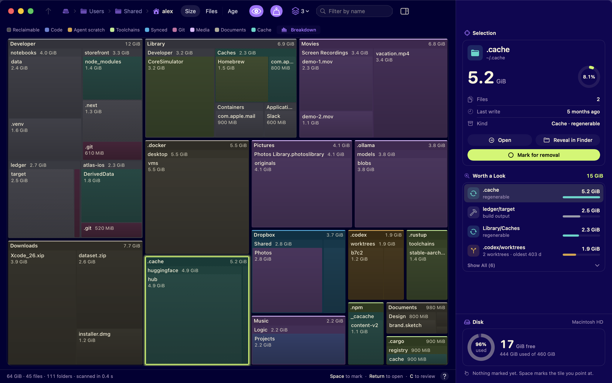

# disktree

<picture>
  <source media="(prefers-color-scheme: dark)" srcset="assets/screenshot-dark.png">
  <source media="(prefers-color-scheme: light)" srcset="assets/screenshot-light.png">
  
</picture>

Find what is filling a disk, mark what should go, and hand the list to
Finder or Terminal — with the volume's free space in view the whole time.

disktree is a treemap for macOS. It scans your home directory by default,
draws every directory as a nested mosaic sized by what it really costs on disk,
and lets you walk into it with the keyboard, the mouse or the trackpad. Mark as
much as you like; disktree never deletes anything itself. The review screen
reveals what you marked in Finder, or copies one command that removes exactly
that list, and then measures what the disk actually gained.

A macOS port of [Tobi Lütke's disktree](https://github.com/tobi/disktree), the
treemap for Omarchy on Linux: the same scan, layout and invariants, rebuilt as a
Mac app.

A native app: AppKit and SwiftUI, Swift Charts, SF Symbols, Quick Look, the
system's haptics, no dependencies. It follows light and dark mode with its own
palette.

## Install

Download `disktree-*-macos-universal.zip` from the
[latest release](https://github.com/kylemclaren/disktree/releases/latest),
unzip it and move `disktree.app` to Applications. Releases are signed ad hoc, not
notarized: the first time, open it, dismiss the warning, then click **Open
Anyway** in System Settings › Privacy & Security; or run `xattr -dr
com.apple.quarantine disktree.app` before opening it. Or build it:

```sh
git clone https://github.com/kylemclaren/disktree
cd disktree
make install
```

`make install` builds a release bundle and puts two things in your home
directory (no root needed):

- `~/Applications/disktree.app` — in Spotlight and Launchpad (Apps on macOS
  26), and in Finder's **Open With** for a folder (it adds a handler; it
  never becomes the default). Drop a folder on its Dock icon to scan it.
- `~/.local/bin/disktree`, a command that runs the same app from a terminal

`make install APPDIR=/Applications` puts the app where every user sees it
(the `disktree` command is still yours, in `~/.local/bin`); uninstall it
with the same `APPDIR`: `make uninstall APPDIR=/Applications`.

You need macOS 15 or newer to run it, and Xcode 26 (Swift 6.2 or newer) to
build it.

### Full Disk Access

macOS keeps some folders in your home directory (Mail, Messages, Safari,
other apps' containers) from every app that has not been given Full Disk
Access. disktree counts what it could not read rather than guessing at it, and
says so; for the whole picture, add it in System Settings › Privacy & Security
› Full Disk Access. The first scan of your home directory offers to take you
there and notices when the access arrives. An ad-hoc signed build is a new app
to macOS each time it is rebuilt, so grant it again after `make install`.

## Use

```sh
disktree            # scan the home directory
disktree --disk     # the whole disk it lives on
disktree ~/src      # or any directory
disktree --help     # options: apparent size, follow links, skip hidden, …
```

Or open the app, drop a folder on the window, or use File › Open Folder… (⌘O).

### The screen

- **Toolbar:** the way up (⌫), then the path from `/` where a window's
  title would be, as Finder draws one, ending in the directory drawn: in
  the tree a step goes there, and the current step's menu (or any step's
  right-click) lists its siblings, largest first with their share and size,
  to jump sideways. Above the scanned root a step is dimmer, and clicking it
  widens the scan to there (see below). Then what is measured — **Size**,
  **Files** or **Age** —, the **Hidden files** and **Apparent size**
  switches, the depth drawn, the name filter (`/`) and the panel's switch.
- **Under it:** the legend, a swatch per kind — point at one to pick its
  kind out of the mosaic — and **Breakdown**, what each kind weighs in the
  directory drawn, as a chart. While a filter is typed, what it matches.
  Inside a marked directory, a chip says so once, with the way to unmark it.
- **Mosaic:** colour is the *kind* of data — code, agent scratch,
  toolchains, synced files, git, media, documents, caches — at one level of
  lightness, lighter with depth. A diagonal hatch is space that can be had
  back (caches, sync history, package stores, build output), independent of
  colour. Top-level directories carry a strip of their colour and a name
  band; deeper open directories a slim label row. In **Age** mode colour is
  the last write instead, from this week to older.
- **Panel:** the selection (its size set large, share of the scan, files,
  last write, and for a checkout what git says — changes, stashes, unpushed
  commits); what is marked, once anything is; *Worth a look*, the largest
  things that could plausibly go, the first few and the rest behind **Show
  All**; and, pinned at its foot, the disk, free now and after the marks,
  with the way to the review screen. The column scrolls under the disk. It
  is the window's inspector: drag its edge to resize it, and it keeps that
  width.
- **Status bar:** what the directory drawn holds and how long the scan took,
  what the scan could not read, how far the view is magnified, a word on the
  keys a first look needs, and the help button, which lists every key and
  gesture (`?`).
- **Pointing:** a tile the pointer rests on shows its card: with the panel
  out, its name and size; with the panel away, its kind, place, share of its
  folder and what it holds.

One colour is kept apart: the highlight — lime in dark mode, violet in light —
marks the selection, the main action, and what can be had back.

The kinds come from directory names and a few shapes (a bare git repository,
`target` beside a `Cargo.toml`, `.build` beside a `Package.swift`,
`DerivedData`). Some of the names are specific to one machine; see
`Sources/DisktreeCore/Classify.swift`.

### Marking

Space, X, Enter and the arrows act on the tile under the pointer if the pointer
moved last, and on the keyboard selection after you use an arrow or Tab.
⌘-click marks without moving the selection; right-click offers Mark, Open,
Quick Look, Reveal in Finder and Copy Path.

A marked tile takes the marked colour, and so does everything inside it:
removing a directory takes its contents with it. Opened, a marked directory
keeps its kinds' colours, tinted toward the marked one, and the legend says
once that everything there goes with the mark. Marking a directory absorbs
any marks already inside it, and something inside a marked directory cannot be
marked or kept on its own; its panel offers to unmark the directory instead.
Marking is reversible — press it again — and the saving is never counted twice.

### Zooming and going in

Scroll or pinch to magnify toward the pointer. The zoom stops where the
directory under the pointer fills the view — on a Force Touch trackpad you feel
it click into place — and a little further goes into it, one continuous
motion, with the directory's contents growing into place. Pinch or scroll the
other way to come back out. A two-finger double tap goes in and back out.
Enter goes into the selected directory at any depth, and Backspace goes up one
level; so does Escape, once no filter and no tile is selected. `+` and `-`
magnify without going in; `0` resets. ⌘Y Quick Looks the selection. Drag a
tile out to Finder, a Terminal window or the Trash.

### Handing it over

`c` (or **Review…**) opens the list of everything marked: what goes, what it
weighs, what is covered by another mark, and anything disktree will not put in
a command, with the reason. Unmark anything there, then:

- **Reveal in Finder** (`f`) selects the marked items in Finder, where Move to
  Trash can be undone with Put Back. Or drag rows from the list to the Trash.
- **Copy Command** (Enter) copies one command for Terminal, one quoted path
  per line: `trash` by default (`m`), which moves them to the Trash, or
  `rm -rfx` (`p`), which deletes them for good and never crosses into a volume
  mounted inside a marked folder.

disktree then watches the marked paths. When they are gone it says how much
free space the disk actually gained — measured, not the sum of what was
marked; APFS snapshots can hold on to space for a while — and scans again so
the numbers on screen match the disk.

## Keys

| key | does |
| --- | --- |
| `space` / `x` | mark or unmark the tile you point at |
| `⌘`-click | mark without moving the selection |
| `enter` | open that directory, at any depth |
| `⌫` / `esc` | go up one directory; `esc` clears a filter or a selected tile first |
| `←` `↑` `↓` `→` | move between tiles at this level |
| `tab` | next largest sibling |
| scroll / pinch | zoom toward a directory, then go into it |
| two-finger double tap | into the directory under the pointer, and back |
| `shift`-scroll | pan the magnified view |
| `[` `]` | draw fewer or more levels at once |
| `=` `-` `0` | magnify, shrink, reset the view |
| `⌘=` `⌘-` `⌘0` | interface zoom |
| `/` | filter by name: only matches keep their colour; `enter` shows only them, `esc` clears |
| `f` | reveal in Finder |
| `⌘Y` | Quick Look |
| `c` | review the marked list |
| `t` | rank by size or by file count, or colour by age |
| `d` | disk usage or apparent size |
| `i` | include or skip hidden entries |
| `r` | scan again |
| `g` | the whole disk |
| `p` | show or hide the side panel |
| `?` | every key |
| `q` / `⌘Q` | quit |

On the review screen: `enter` copies the command, `f` reveals in Finder, `m`
trash, `p` rm, `!` unmark all, `esc` goes back.

Settings (⌘,) keeps the defaults — depth, hidden files, apparent size, one
volume, the command style, the panel — and disktree remembers the panel's
width, the interface zoom and the colour mode between runs.

## What it measures

- **Disk usage** by default: `st_blocks × 512`, the number `du` reports and the
  space that actually comes back when a file is deleted. Apparent size (what
  `ls -l` shows) is one toggle away.
- **Hardlinks once.** Two names for one inode cost one file.
- **Hidden entries included** — names that start with a dot — because
  `~/.cache` and its like are often among the biggest things in a home
  directory. Symlinks are not followed.
- **APFS clones** are counted in full: a cloned file shares its blocks with
  the original until one of them changes, so removing only one of a pair may
  free less than it weighs. The gain disktree reports afterwards is measured,
  so it is never overstated.

The scan follows [dust](https://github.com/bootandy/dust)'s approach — a
completion counter per directory so no directory is built before its last
subdirectory lands, and one bottom-up pass that aggregates sizes and removes
duplicate hardlinks — on eight threads that read each directory with
`getattrlistbulk`, a batch of names, sizes and identities per system call.

## The whole disk

Click `/` (or any directory above the scanned root) in the trail, press `g`,
run `disktree --disk`, or use the Dock menu's *Scan the Whole Disk*. On a Mac
that is `/`.

Widening is memoized: the tree already measured is handed to the wider walk
and reused where it is reached, so going from `~` to `/` reads only what is
outside `~`. The current view stays on screen until the wider tree lands,
which then opens with the directory you came from selected. Going back down is
just navigation.

A scan stays on one volume, and a volume is decided by path, not by device
number. On a Mac `/` is the read-only system volume and your data lives on
the Data volume, reached through firmlinks (`/Users`, `/Applications`,
`/Library`, `/private`, …): those are walked, and `/System/Volumes/Data`
itself is left out so nothing is counted twice. The other system volumes,
`/dev`, other disks under `/Volumes`, network shares, automounts, simulator
runtimes and snapshots are left out too — checked by path, so an automounted
share is never mounted just to be measured. `-X` crosses into everything.

## What it refuses to do

disktree never deletes, moves or trashes anything itself. The rules for what
goes into a command or to Finder live in
`Sources/DisktreeCore/Removal.swift`, and each one is tested:

- only paths under the scanned root;
- never the filesystem root, the scanned root, your home directory or any
  directory that holds it, or `~/Library` itself (what is inside it is fine);
- never a mount point or a firmlink, since removing it would reach into
  another volume, and never a directory with a volume mounted inside it,
  which the Trash would take along, still mounted;
- never a path reached through a symlink, never a name that is not valid
  UTF-8, and never one that holds a control character, which the terminal
  a command is pasted into would act on before any shell saw the quotes;
- never a tree the system or a package manager owns (`/System`, `/usr`,
  `/bin`, `/private/var/db`, `/Library/Apple`, `/opt/homebrew`, `/nix/store`,
  …): use its own tool;
- every path in a command is absolute and single-quoted, so no name can be
  read as an option or expanded by the shell, and `rm` runs with `-x`.

## Develop

```sh
make run      # release build, scanning $HOME (or make run ARGS=~/src)
make lint     # swift format --strict, then a warnings-as-errors build
make test     # core and app tests, including real windows
make ci       # lint, then test
make icon     # redraw the icon from the mark
```

The lint gate is strict on purpose: `swift format lint --strict` with no force
unwraps, 80 columns — counted again by `scripts/columns.sh` for the comments
and strings swift format cannot rewrap — and every warning an error. The app
tests host the real screens in offscreen windows, press real keys and send
real mouse and trackpad events — including one that marks a directory, copies
the command, runs it, and checks that the files are gone while their
neighbours are not.

| path | what lives there |
| --- | --- |
| `Sources/DisktreeCore` | scanning, the tree, the squarified layout, free space, and what may be removed — no UI |
| `Sources/DisktreeApp/AppState*.swift` | every action the interface can take, and the key map |
| `Sources/DisktreeApp/*View.swift`, `SidePanel*.swift`, `Toolbar.swift`, … | the screens and the window's toolbar, in SwiftUI |
| `Sources/DisktreeApp/TreemapNSView.swift`, `MosaicRaster.swift` | painting the mosaic and its labels, and every pointer and trackpad gesture |
| `Sources/DisktreeApp/Theme.swift`, `Palette.swift`, `UI.swift` | the palette, what colour means, and the spacing and type scale, in rem |
| `Tests/` | core tests against real temporary trees, and app tests through real windows |
| `packaging/`, `scripts/`, `assets/`, `Makefile` | the app bundle, the icon, and install |

## License

MIT
